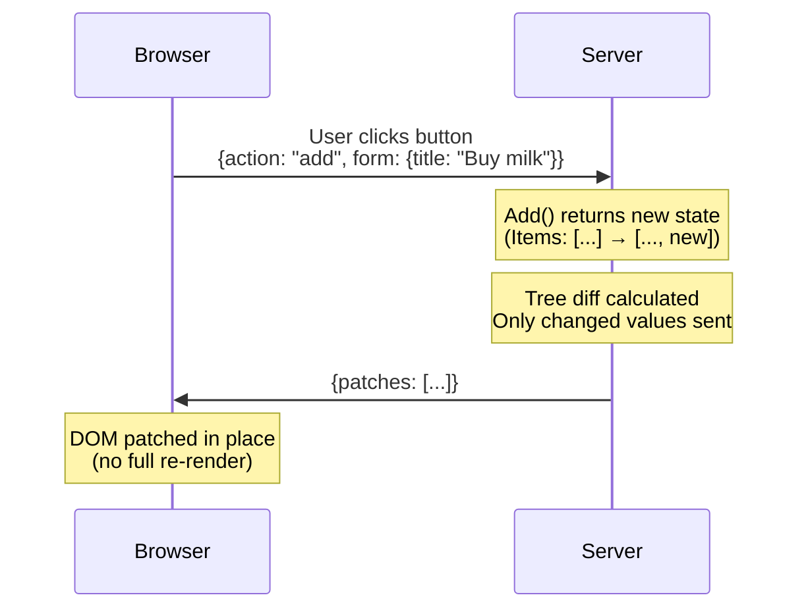

# Reactive web UIs in standard HTML and Go

LiveTemplate is a Go library for building reactive web UIs from standard `html/template` templates. You write a template and a controller struct; when state changes, the template re-renders on the server and only the diff is sent to the browser. The same code runs three ways: a plain `<form>` POST that reloads the page, a `fetch()` request that patches the DOM in place, or a WebSocket session where other tabs sync automatically.

> **Alpha** — core features work and are tested, but the API may change before v1.0.

## Try it

```embed-lvt path="/apps/counter-basic/" upstream="http://localhost:9091" height="140px"
```

Click the buttons. Each click POSTs the action to the Go server; the server runs `Increment`, re-renders the template, diffs against the previous render, and sends only the changed text node back. The form, the buttons, and the count display are never re-created — only the count's text changes, patched into the page over a WebSocket with no full reload.

The widget above is a real, deployed LiveTemplate app — the same code as Steps 1–5 of the [Your First App](/getting-started/your-first-app) tutorial, embedded inline through tinkerdown's auto-proxy.

## The code that runs the demo above

The state and handlers — `counter.go`:

```go include="/examples/counter-basic/counter.go" lines="10-31"
```

The template — `counter.tmpl`:

```html include="/examples/counter-basic/counter.tmpl"
```

A button's `name` attribute IS the routing key — `<button name="increment">` posts `increment` and LiveTemplate dispatches to the `Increment` method on the controller. The protocol between HTML and Go is just the form data the browser already sends.

[Read the full walkthrough →](/getting-started/your-first-app)

## Next level: real-time multi-tab sync

The counter above reacts within a single tab. The same app becomes *real-time across tabs* by adding two server-side calls — no client-side code, no extra dependencies:

```embed-lvt path="/apps/counter/" upstream="http://localhost:9091" height="140px"
```

Open this page in a second tab and click `+1` in either one — the count stays in sync across both tabs in real time. Two additions to `counter.go` make that happen: a `Mount` that opts the connection in with `ctx.Subscribe(ctx.SelfTopic())`, and a `ctx.Publish(ctx.SelfTopic(), ...)` at the end of each handler that fans the action out to every other tab in the same session (highlighted below):

```go include="/examples/counter/counter.go" lines="17-45" highlight="20,32,41"
```

[Counter, deeper](/recipes/counter) unpacks the session-group routing, why `AnonymousAuthenticator` is the right default for public demos, and where peer fan-out stops scaling.

## What happens between a click and a DOM update



When a user clicks a button, LiveTemplate calls a method on your Go struct, diffs the template output against the previous render, and sends only what changed.

[See the full architecture walkthrough →](/recipes/architecture-flow)

## Get started

1. **[Install](/getting-started/install)** — `go get`, ~30 seconds
2. **[Your First App](/getting-started/your-first-app)** — counter app from scratch in 10 minutes
3. **[Progressive Complexity](/guides/progressive-complexity)** — when to reach for `lvt-*` attributes (and when not to)
4. **[Recipes](/recipes/)** — basics, UI patterns, runnable apps, and deep dives

## Or browse

- **[Guides](/guides/progressive-complexity)** — conceptual walkthroughs, scaling, observability
- **[Reference](/reference/api)** — types, attributes, configuration, controller pattern
- **[CLI (`lvt`)](/cli)** — code generator, dev server, kit system
- **[TypeScript Client](/client)** — `@livetemplate/client` npm package
- **[Recipes](/recipes/)** — basics, UI patterns, runnable apps, and deep dives
- **[Changelog](/changelog)** — releases across all four repos

## How this site is built

This is a [tinkerdown](https://github.com/livetemplate/tinkerdown) site. Most reference and package pages are mirrored from canonical files in the source repos ([livetemplate](https://github.com/livetemplate/livetemplate), [client](https://github.com/livetemplate/client), [lvt](https://github.com/livetemplate/lvt), [examples](https://github.com/livetemplate/examples)) and re-published on each release. Recipe apps and UI pattern recipes are served by the docs-site recipes binary so the examples stay interactive inside the docs. The "Edit this page on GitHub" link in every footer points to the canonical source — that's where corrections should land. See [How This Docs Site Works](/recipes/how-this-site-works) for the full dogfood loop.
