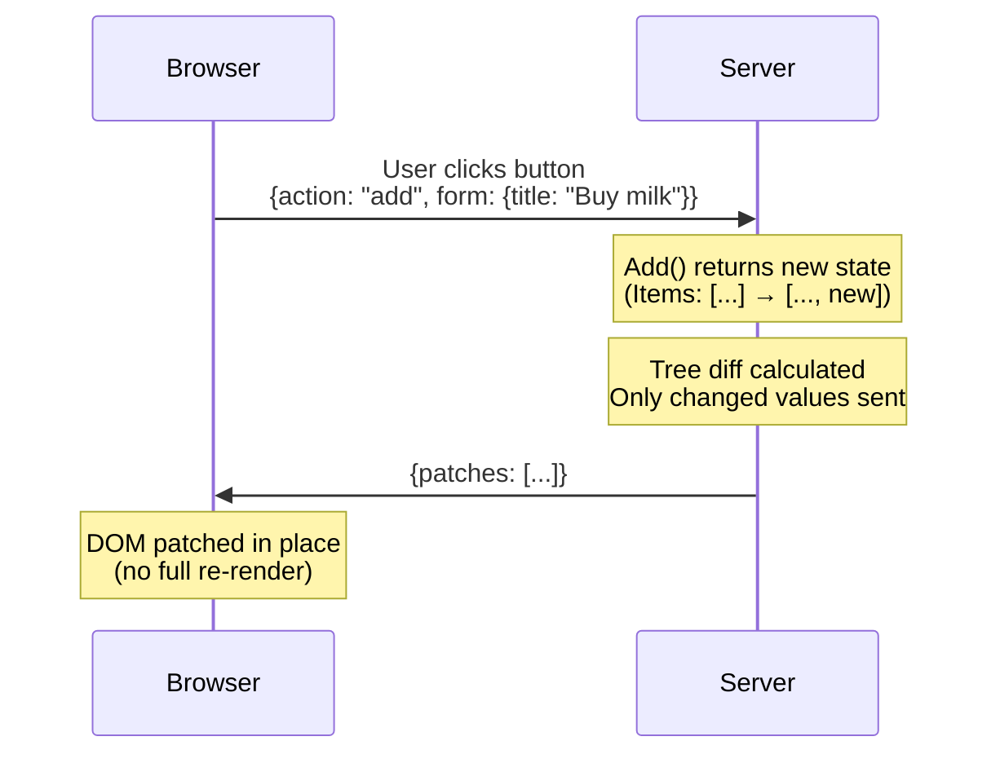

# Reactive web UIs in standard HTML and Go

LiveTemplate is a Go library for building reactive web UIs from standard `html/template` templates. You write a template and a controller struct; when state changes, the template re-renders on the server and only the diff is sent to the browser. The same code runs three ways: a plain `<form>` POST that reloads the page, a `fetch()` request that patches the DOM in place, or a WebSocket session where other tabs sync automatically.

> **Alpha** — core features work and are tested, but the API may change before v1.0.

## Try it

<iframe src="https://lt-landing-demo.fly.dev/" title="Live LiveTemplate counter — click the buttons" loading="lazy" style="width:100%;height:340px;border:1px solid #ddd;border-radius:8px;background:#fff;"></iframe>

Click the buttons. Each click POSTs the action to the Go server; the server runs `Increment`, re-renders the template, diffs against the previous render, and sends only the changed text node back. The form, the buttons, and the count display are never re-created — only the count's text changes. Open the page in a second tab in the same browser session: clicks in one tab show up in the other over WebSocket, because the state is keyed to your session.

The iframe loads a real, deployed [LiveTemplate app](https://github.com/livetemplate/examples/tree/main/landing-demo) running standalone at `lt-landing-demo.fly.dev` — the same code you'd write yourself.

## The code that runs the demo above

The whole app is two files. **The controller**:

```go
type CounterController struct{}

type CounterState struct {
    Count int `json:"count" lvt:"persist"`
}

func (c *CounterController) Increment(s CounterState, ctx *livetemplate.Context) (CounterState, error) {
    s.Count++
    return s, nil
}

func (c *CounterController) Decrement(s CounterState, ctx *livetemplate.Context) (CounterState, error) {
    s.Count--
    return s, nil
}

func (c *CounterController) Reset(s CounterState, ctx *livetemplate.Context) (CounterState, error) {
    s.Count = 0
    return s, nil
}
```

**The template**:

```html
<p class="count">{{.Count}}</p>
<form method="POST">
    <fieldset role="group">
        <button name="decrement">−1</button>
        <button name="reset">Reset</button>
        <button name="increment">+1</button>
    </fieldset>
</form>
```

**The wire-up** (the rest of `main.go`):

```go
tmpl := livetemplate.Must(livetemplate.New("counter",
    livetemplate.WithParseFiles("counter.tmpl"),
))
handler := tmpl.Handle(&CounterController{}, livetemplate.AsState(&CounterState{}))
http.ListenAndServe(":8080", handler)
```

A button's `name` attribute IS the routing key — `<button name="increment">` posts `increment` and LiveTemplate dispatches to the `Increment` method on the controller. The protocol between HTML and Go is just the form data the browser already sends. The `lvt:"persist"` tag on `Count` makes the field survive WebSocket reconnects and propagate across tabs in the same session.

[See the full source on GitHub →](https://github.com/livetemplate/examples/tree/main/landing-demo)

## What happens between a click and a DOM update



When a user clicks a button, LiveTemplate calls a method on your Go struct, diffs the template output against the previous render, and sends only what changed.

[See the full architecture walkthrough →](/recipes/architecture-flow)

## Get started

1. **[Install](/getting-started/install)** — `go get`, ~30 seconds
2. **[Your First App](/getting-started/your-first-app)** — counter app from scratch in 10 minutes
3. **[Progressive Complexity](/guides/progressive-complexity)** — when to reach for `lvt-*` attributes (and when not to)
4. **[Patterns catalog](/patterns/)** — 33 interactive UI patterns, live demos with source

## Or browse

- **[Guides](/guides/progressive-complexity)** — conceptual walkthroughs, scaling, observability
- **[Reference](/reference/api)** — types, attributes, configuration, controller pattern
- **[CLI (`lvt`)](/cli)** — code generator, dev server, kit system
- **[TypeScript Client](/client)** — `@livetemplate/client` npm package
- **[Examples](/examples/)** — runnable apps for every common pattern
- **[Recipes](/recipes/architecture-flow)** — interactive walkthroughs of how the framework works
- **[Changelog](/changelog)** — releases across all four repos

## How this site is built

This is a [tinkerdown](https://github.com/livetemplate/tinkerdown) site. Most pages are mirrored from canonical files in the source repos ([livetemplate](https://github.com/livetemplate/livetemplate), [client](https://github.com/livetemplate/client), [lvt](https://github.com/livetemplate/lvt), [examples](https://github.com/livetemplate/examples)) and re-published on each release. Pattern detail pages are reverse-proxied to a deployed [livetemplate/examples/patterns](https://github.com/livetemplate/examples/tree/main/patterns) showcase. The "Edit this page on GitHub" link in every footer points to the canonical source — that's where corrections should land. See [How This Docs Site Works](/recipes/how-this-site-works) for the full dogfood loop.
