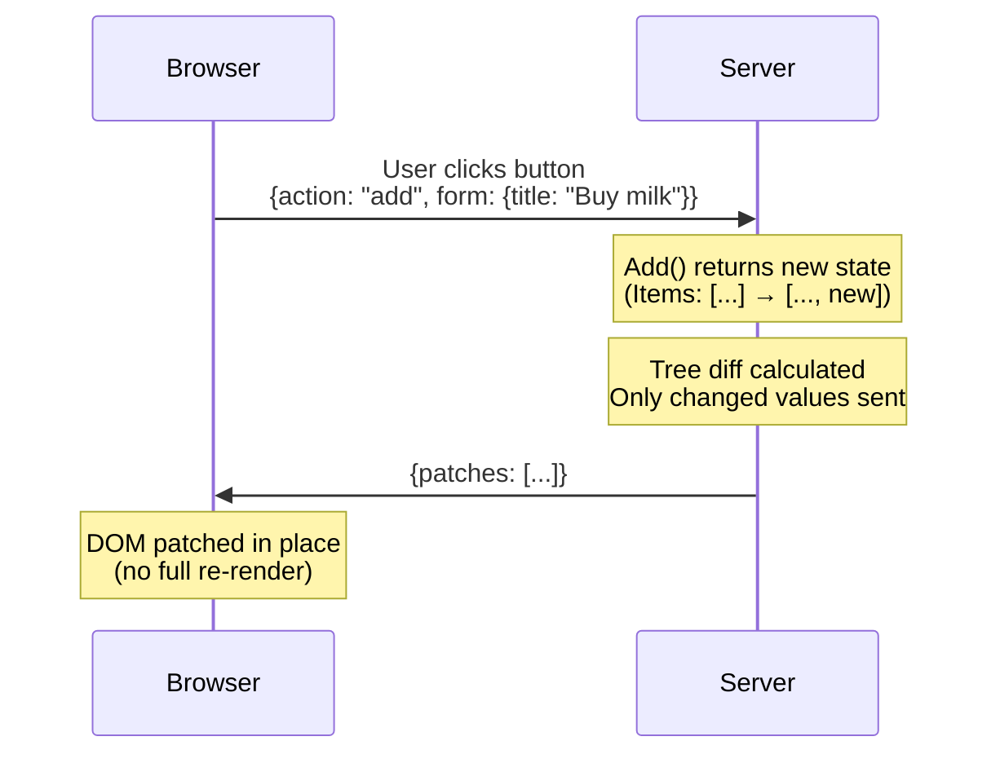

# Reactive web UIs in standard HTML and Go

LiveTemplate is a Go library for building reactive web UIs from standard `html/template` templates. You write a template and a controller struct; when state changes, the template re-renders on the server and only the diff is sent to the browser. The same code runs three ways: a plain `<form>` POST that reloads the page, a `fetch()` request that patches the DOM in place, or a WebSocket session where other tabs sync automatically.

> **Alpha** — core features work and are tested, but the API may change before v1.0.

## Try it

```lvt
<div lvt-source="landing_tasks" style="border:1px solid var(--border-color,#ddd);border-radius:8px;padding:1rem 1.25rem;background:var(--card-background-color,#fff);">
{{if .Error}}
<p><mark>{{.Error}}</mark></p>
{{else}}
<ul style="list-style:none;padding:0;margin:0 0 .5rem 0;">
{{range .Data}}
<li style="display:flex;gap:.5rem;align-items:center;padding:.25rem 0;">
  <input type="checkbox" {{if .Done}}checked{{end}} lvt-on:click="Toggle" data-id="{{.Id}}">
  <span {{if .Done}}style="text-decoration:line-through;opacity:.6"{{end}}>{{.Text}}</span>
</li>
{{end}}
</ul>
<small>Open this page in another tab and toggle a checkbox — both tabs stay in sync.</small>
{{end}}
</div>
```

Click any checkbox above. The server diffs the new render against the previous one, sends only the changed attributes to the browser, and the DOM is patched in place — the input you just clicked never re-renders, so focus and scroll position are preserved. Open the page in a second tab and toggle there: both tabs update over WebSocket.

## The same pattern, written directly in LiveTemplate

The block above is rendered through tinkerdown, which wraps LiveTemplate. Without that wrapper, the same demo in raw LiveTemplate is a controller struct and a template:

The template:

```html
<ul>
{{range .Tasks}}
<li>
    <input type="checkbox" {{if .Done}}checked{{end}} lvt-on:click="Toggle" data-id="{{.ID}}">
    <span>{{.Text}}</span>
</li>
{{end}}
</ul>
```

The controller:

```go
type TaskController struct{}

func (c *TaskController) Toggle(state TaskState, ctx *livetemplate.Context) (TaskState, error) {
    id := ctx.GetString("id")
    for i, t := range state.Tasks {
        if t.ID == id {
            state.Tasks[i].Done = !state.Tasks[i].Done
        }
    }
    return state, nil
}
```

The `lvt-on:click="Toggle"` attribute names the routing key; LiveTemplate dispatches to the controller's `Toggle` method using the form data and `data-*` attributes the browser already sends. The wire is HTTP and the message format is HTML.

## What happens between a click and a DOM update



When a user clicks a button, LiveTemplate calls a method on your Go struct, diffs the template output against the previous render, and sends only what changed.

[See the full architecture walkthrough →](/recipes/architecture-flow)

## Get started

1. **[Install](/getting-started/install)** — `go get`, ~30 seconds
2. **[Your First App](/getting-started/your-first-app)** — counter app from scratch in 10 minutes
3. **[Progressive Complexity](/guides/progressive-complexity)** — when to reach for `lvt-*` attributes (and when not to)
4. **[Patterns catalog](/patterns/)** — 33 interactive UI patterns, live demos with source

## Or browse

- **[Guides](/guides/progressive-complexity)** — conceptual walkthroughs, scaling, observability
- **[Reference](/reference/api)** — types, attributes, configuration, controller pattern
- **[CLI (`lvt`)](/cli)** — code generator, dev server, kit system
- **[TypeScript Client](/client)** — `@livetemplate/client` npm package
- **[Examples](/examples/)** — runnable apps for every common pattern
- **[Recipes](/recipes/architecture-flow)** — interactive walkthroughs of how the framework works
- **[Changelog](/changelog)** — releases across all four repos

## How this site is built

This is a [tinkerdown](https://github.com/livetemplate/tinkerdown) site. Most pages are mirrored from canonical files in the source repos ([livetemplate](https://github.com/livetemplate/livetemplate), [client](https://github.com/livetemplate/client), [lvt](https://github.com/livetemplate/lvt), [examples](https://github.com/livetemplate/examples)) and re-published on each release. Pattern detail pages are reverse-proxied to a deployed [livetemplate/examples/patterns](https://github.com/livetemplate/examples/tree/main/patterns) showcase. The "Edit this page on GitHub" link in every footer points to the canonical source — that's where corrections should land. See [How This Docs Site Works](/recipes/how-this-site-works) for the full dogfood loop.
