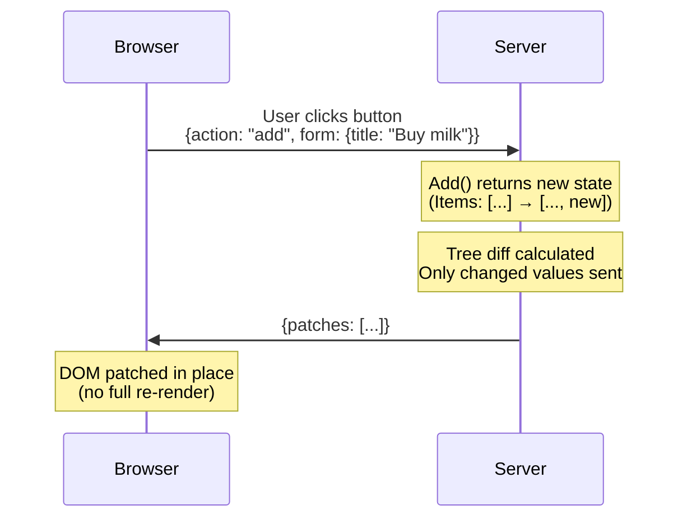

# Reactive web UIs in standard HTML and Go

No custom template language. No client-side framework. No persistent connection required. Forms POST. Buttons submit. Add the JS client and the DOM patches in place. Add a WebSocket and other tabs sync automatically.

> **Alpha** — core features work and are tested, but the API may change before v1.0.

## A todo list, end to end

The HTML:

```html
<form method="POST">
    <input type="text" name="title" required placeholder="What needs to be done?">
    <button name="add">Add Todo</button>
</form>
<ul>
{{range .Items}}<li>{{.Title}}</li>{{end}}
</ul>
```

The Go:

```go
func (c *TodoController) Add(state TodoState, ctx *livetemplate.Context) (TodoState, error) {
    state.Items = append(state.Items, Todo{Title: ctx.GetString("title")})
    ctx.BroadcastAction("Refresh", nil) // pushes the update to other WS-connected tabs
    return state, nil
}
```

The button's `name` IS the action — `<button name="add">` routes to `Add()`. No custom attributes, no JavaScript wiring. Without JS the form POSTs normally; with the JS client the DOM patches in place.

## What happens between a click and a DOM update



When a user clicks a button, LiveTemplate calls a method on your Go struct, diffs the template output against the previous render, and sends only what changed.

[See the full architecture walkthrough →](/recipes/architecture-flow)

## Get started

1. **[Install](/getting-started/install)** — `go get`, ~30 seconds
2. **[Your First App](/getting-started/your-first-app)** — counter app from scratch in 10 minutes
3. **[Progressive Complexity](/guides/progressive-complexity)** — when to reach for `lvt-*` attributes (and when not to)
4. **[Patterns catalog](/patterns/)** — 33 interactive UI patterns, live demos with source

## Or browse

- **[Guides](/guides/progressive-complexity)** — conceptual walkthroughs, scaling, observability
- **[Reference](/reference/api)** — types, attributes, configuration, controller pattern
- **[CLI (`lvt`)](/cli)** — code generator, dev server, kit system
- **[TypeScript Client](/client)** — `@livetemplate/client` npm package
- **[Examples](/examples/)** — runnable apps for every common pattern
- **[Recipes](/recipes/architecture-flow)** — interactive walkthroughs of how the framework works
- **[Changelog](/changelog)** — releases across all four repos

## How this site is built

This is a [tinkerdown](https://github.com/livetemplate/tinkerdown) site. Most pages are mirrored from canonical files in the source repos ([livetemplate](https://github.com/livetemplate/livetemplate), [client](https://github.com/livetemplate/client), [lvt](https://github.com/livetemplate/lvt), [examples](https://github.com/livetemplate/examples)) and re-published on each release. Pattern detail pages are reverse-proxied to a deployed [livetemplate/examples/patterns](https://github.com/livetemplate/examples/tree/main/patterns) showcase. The "Edit this page on GitHub" link in every footer points to the canonical source — that's where corrections should land. See [How This Docs Site Works](/recipes/how-this-site-works) for the full dogfood loop.
