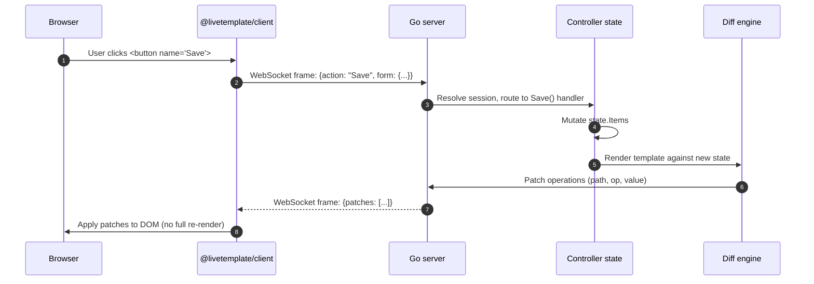

# How a LiveTemplate Update Flows

A walkthrough of the moving parts behind a single user interaction — from browser click to DOM patch — rendered as a sequence diagram you can step through.

> **Tip.** Hit the presentation-mode button (top-right) to walk through the H2 sections one at a time. Useful for demos, screen-share-friendly.

## The full flow at a glance



## 1. The user interacts

Standard HTML emits a click. There's no `onclick=` handler — just a `name="Save"` attribute on a `<button>` inside a `<form>`.

```html
<form name="save-form">
    <input name="title" required>
    <button type="submit" name="Save">Save</button>
</form>
```

The `@livetemplate/client` script — loaded once per page — intercepts the submit, packages the form data, and ships it over an existing WebSocket connection.

## 2. The server routes the action

The server has a controller registered against the route. The `Save` button's name maps to a `Save(ctx)` method on the controller. There is no router-config table — the method name **is** the route.

```go
func (c *NotesController) Save(ctx *livetemplate.Context) {
    var req struct{ Title string }
    ctx.BindAndValidate(&req)
    c.state.Items = append(c.state.Items, Item{Title: req.Title})
}
```

## 3. The state mutates

The controller holds a struct of plain Go fields. `Save` appends an item — that's it. No diffing logic in user code, no manual DOM bookkeeping, no virtual-DOM tree to construct.

## 4. The diff engine produces patches

After every action, LiveTemplate re-renders the page's Go template against the new state, then diffs against the previously-rendered HTML. The output is a small list of patch operations — `replace this attribute`, `insert this child at index N`, `remove this node`.

The patches travel back to the browser as a single WebSocket frame, typically under 1 KB even for visible UI changes.

## 5. The client applies patches

`@livetemplate/client` walks the patch list and mutates the live DOM in place. There is no React-style reconciliation step, no full innerHTML reset. The browser keeps focus, keeps scroll position, keeps in-flight CSS animations.

## What you can change to see this in action

Open the [todos example](/examples/todos) in two browser tabs. Add an item in tab 1 — it appears in tab 2 within ~30ms because the controller calls `ctx.Sync()` on every mutation, broadcasting the patch frame to every connected session for the same controller.

## How this page works

This page is itself two interactive tinkerdown features:

- The **Mermaid block** above is a fenced ` ```mermaid ` code block. Tinkerdown's bundled mermaid runtime renders it client-side as an SVG sequence diagram on page load.
- **Presentation mode** is the icon to the upper right of the page chrome. Clicking it sets `body.presentation-mode`, which hides the sidebar and walks through H2 sections one at a time using the keyboard arrows. No markdown syntax required — every H2 becomes a slide.

This means a single markdown file doubles as both **reference documentation** (when read top-to-bottom) and a **walkthrough talk** (when presented). The diagram source lives next to the prose explaining it — they cannot drift.
