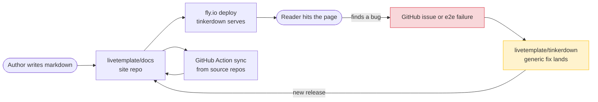

# How This Docs Site Works (Meta)

A docs site for a framework should answer the implicit question every visitor brings: *"OK, but is this thing real? Could I actually build something with it?"*. The most honest answer is to be one yourself.

This site is a [tinkerdown](https://github.com/livetemplate/tinkerdown) app — markdown files, one configuration file, no React. Every page you see is rendered by tinkerdown, which runs on top of LiveTemplate. The bug-finding loop is a feedback cycle: building the docs uncovers latent issues in the framework, and we fix them in the framework rather than working around them in the site.

## The shape of the dogfood loop



Concrete examples this site found and the framework absorbed:

- **`ws://` for HTTPS pages** (G11) — every interactive block silently failed under HTTPS. The site was the first HTTPS-served tinkerdown deployment with `lvt-source` blocks; the bug had no other discovery path.
- **gzip empty-stream tail** — `compressionMiddleware`'s deferred `gz.Close()` flushed a 23-byte trailing gzip frame that Chrome rejected as `ERR_CONTENT_DECODING_FAILED`. Caught when the patterns reverse-proxy started erroring.
- **CSS source-order specificity** for theme overrides — token customisation was being defeated by tinkerdown's own default CSS being declared *after* the override.

None of these would have surfaced in unit tests. They needed a real, reasonably-trafficked site running with real assets.

## Live numbers from this very page

The catalog this site exposes is itself driven by the same `lvt-source="patterns"` REST binding the site uses everywhere:

```lvt
<div lvt-source="patterns">
    {{if .Error}}
    <p><mark>{{.Error}}</mark></p>
    {{else}}
    <p data-test="meta-summary">
        Right now: <strong>{{len .Data}}</strong> pattern categories, served from
        <a href="https://lt-patterns.fly.dev/api/index.json"><code>lt-patterns.fly.dev/api/index.json</code></a>,
        cached 5 minutes at the docs-site edge.
    </p>
    {{end}}
</div>
```

That number isn't hardcoded. It's a server-side template render, executed when this page loaded, against a live JSON endpoint of a separate fly.io deployment.

## What's in the site that isn't in tinkerdown core

A few site-specific moving parts live in the [`livetemplate/docs`](https://github.com/livetemplate/docs) repo, not in tinkerdown itself:

| Piece | Lives in | Why not in tinkerdown |
|---|---|---|
| Source-of-truth matrix (which repo owns which doc) | `content/_meta/source-of-truth.{md,yaml}` | Specific to *this* docs site's content layout |
| Sync program (cross-repo content mirror) | `cmd/sync/` (Go) | Specific to this site's release-tag-driven sync model |
| GitHub Actions sync workflow | `.github/workflows/sync.yml` | Per-deployment ops choice |
| Recipes content (this page included) | `content/recipes/` | Just markdown |

Everything else — proxy routing, theme tokens, mermaid bundling, `lvt-source` REST, `wss://` scheme detection, edit-on-GitHub links — lives in tinkerdown as **generic features**. The discipline is: *if the site needs it, tinkerdown should provide it for any site*.

## Reading list

- [Anatomy of the Patterns Catalog](/recipes/patterns-stats) — same `patterns` source, different view
- [How a LiveTemplate Update Flows](/recipes/architecture-flow) — what happens between a click and a DOM patch
- [Live Framework Releases](/recipes/live-releases) — proves a 2nd REST source works
- [The patterns catalog itself](/patterns/) — recipe 1, doubled as the catalog page
