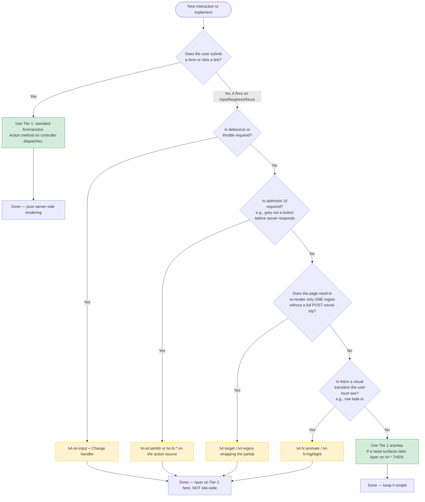

# When to Reach for `lvt-*` (Decision Tree)

LiveTemplate has two tiers. **Tier 1** is plain HTML — `<form method="POST">`, `<a href="...">`, no JavaScript. **Tier 2** is the `lvt-*` attribute layer — debounced inputs, animations, optimistic UI, scoped DOM updates.

The framework's prevailing rule: **don't reach for Tier 2 unless Tier 1 has demonstrably hit its ceiling**. This page renders that rule as a decision tree you can walk before writing the next interaction.

## Why this matters

Every Tier 2 attribute is a small JavaScript dependency in the user's browser — a thing that can fail, can race, can accumulate. The framework was designed so the **escape hatch is opt-in per element**, not a global mode. A page can be 95% Tier 1 with one `<input lvt-on:input>` for live search and that's a feature, not a smell.

The most common Tier 2 over-application is **using `lvt-on:click` for a button that's inside a `<form>`**. If the form already has `name="Save"`, you don't need anything — submit dispatches. The Tier 2 layer is for cases where standard form/anchor semantics are inadequate, not for "everything I'd write in React."

## How this page works

This decision tree is a `mermaid` flowchart block — `\`\`\`mermaid` fence with a flowchart definition. Tinkerdown's bundled mermaid runtime renders it client-side after `DOMContentLoaded`. No template binding, no server round-trip — just a markdown block that becomes an SVG diagram.

For more on Tier 1 vs Tier 2 see the canonical reference at [Progressive Complexity](/guides/progressive-complexity).
