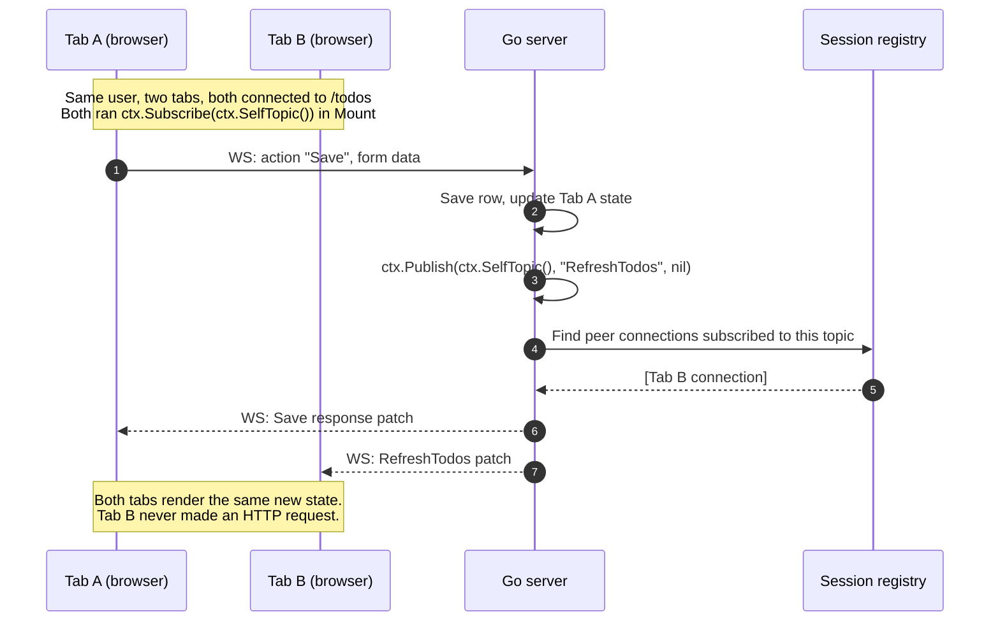

# Pubsub

When one user's action should also update *other* connected viewers — their other
tabs, or other users in a room — LiveTemplate uses **publish/subscribe**. Each
connection that wants peer updates opts in with `ctx.Subscribe(topic)` (usually in
`Mount`); the action that changed shared state fans out with
`ctx.Publish(topic, action, data)`. Both calls take the same topic string:

- **`ctx.SelfTopic()`** — "my own session's tabs." It resolves to
  `lvt:session:<groupID>`, and the browser cookie pins every tab to one group, so
  a Publish reaches the user's other tabs.
- **A developer-named topic** like `"announcements"` — cross-session reach, for
  rooms or global feeds. Admit it in `WithTopicACL` first.

Peers receive the published action and run it like any other action: the handler
re-reads shared state and returns it, and the framework diffs and patches — the
same pipeline as a single-user action. The only difference is *which* connections
the action reaches.

## How a publish reaches a peer



The canonical "fan out to my own session":

```go
func (c *TodosController) Mount(state State, ctx *livetemplate.Context) (State, error) {
    // Opt this connection in to peer fan-out for the session.
    _ = ctx.Subscribe(ctx.SelfTopic())
    return state, nil
}

func (c *TodosController) Save(state State, ctx *livetemplate.Context) (State, error) {
    c.DB.Save(ctx.UserID(), ctx.GetString("title"))
    state.Items = c.DB.List(ctx.UserID())
    ctx.Publish(ctx.SelfTopic(), "RefreshTodos", nil)
    return state, nil
}

func (c *TodosController) RefreshTodos(state State, ctx *livetemplate.Context) (State, error) {
    state.Items = c.DB.List(ctx.UserID())
    return state, nil
}
```

**Peer fan-out is opt-in.** A connection that didn't call `Subscribe` receives
nothing — `Publish` runs cleanly but reaches zero subscribers in this group. If
your peer tabs aren't updating, "did the receiver Subscribe?" is the first thing
to check.

## Watch it in action

Two embeds of the same counter, sharing `session="recipe-pubsub"`. The upstream's
`Mount` calls `ctx.Subscribe(ctx.SelfTopic())` and each handler calls
`ctx.Publish(ctx.SelfTopic(), "Increment", nil)` (or `"Decrement"`) — that's what
keeps them in lockstep:

<div class="recipe-pubsub-grid" style="display: grid; grid-template-columns: 1fr 1fr; gap: 1rem;">

```embed-lvt path="/apps/counter/" upstream="http://localhost:9091" session="recipe-pubsub" height="200px"
```

```embed-lvt path="/apps/counter/" upstream="http://localhost:9091" session="recipe-pubsub" height="200px"
```

</div>

Click `+1` in either widget; the other moves at the same time. The `session=`
attribute is authoring intent (it groups the embeds visually); the actual
cross-region sync comes from each embed calling `Subscribe(SelfTopic())` in Mount
and `Publish(SelfTopic(), ...)` in the action, plus a constant-groupID
authenticator on the upstream — see the [`sharedAuth` definition in
main.go](/getting-started/your-first-app#step-6).

## Pubsub vs server push

| Need | Use |
|---|---|
| A user action should update peer tabs after it succeeds | Subscribe to `ctx.SelfTopic()` in Mount; `ctx.Publish(ctx.SelfTopic(), "Refresh...", nil)` from the action |
| A user action should reach beyond the current session (room, announcement) | Subscribe to a developer-defined topic (admitted in `WithTopicACL`); `Publish` to it from the action |
| A background goroutine / timer / job should push to live connections | [Server push](/recipes/server-push) — `session.TriggerAction(...)` |
| The current connection should update from its own action | Return the new state from the action |

Nothing crosses connections implicitly. If another connection should update, the
action says so — explicitly, by topic. For server-*owned* work that pushes without
a client action, see [Server push](/recipes/server-push).

---

## Worked example: a multi-author message log

[Counter, deeper](/recipes/counter) shared one integer across a browser's tabs.
This shares a multi-author message log across the same scope — the same
Subscribe/Publish primitives, with two design choices that change everything:
which fields are per-connection vs. persisted, and where the source of truth
lives. The live demo is the [Pubsub pattern](/recipes/ui-patterns/realtime/pubsub):

```embed-lvt path="/apps/ui-patterns/realtime/pubsub" upstream="http://localhost:9091" height="380px"
```

Open the page in a second tab. Join with a different name. Send a message from
either side. Both update. Both tabs are in the same session group (same cookie),
so each tab's `SelfTopic()` resolves to the same string, and a Publish from either
reaches both — but each tab keeps its own `Username` because identity is
per-connection, not persisted.

(For a setup where every visitor — across browsers, across machines — sees the
same fan-out, you'd swap [`AnonymousAuthenticator`](/reference/authentication) for
one that returns a constant group ID, or define a developer-named topic like
`"announcements"` and admit it in `WithTopicACL`. That's an authentication or ACL
choice, not a `Publish` choice.)

### Anatomy of the state

```go include="/examples/patterns/state_realtime.go" region="pubsub-state"
```

Note what's *not* persisted. `Username` looks like a candidate for
`lvt:"persist"` — it's user identity, surely you want it to survive a reconnect?
But persist storage is keyed by **session group**, so persisting `Username` would
force every tab in the same browser to share one identity, defeating the demo
where two tabs join as different users.

The pattern that *does* persist state across reconnects is `ReconnectionState`
(also in this file) — different recipe, same package. Same fan-out scope (session
group), but every connection sees the same value across drops because the field is
`lvt:"persist"`-tagged.

### Where the messages live

```go include="/examples/patterns/handlers_realtime.go" region="pubsub-controller"
```

The message log is on the **controller**, not in state. State is per-connection;
the controller is the singleton dependency layer the [Controller+State
pattern](/reference/controller-pattern) puts in front of every connection routed
to this handler. `c.messages` is the source of truth — every tab reads from it
under the same `RWMutex`.

The `Mount` method runs on every initial render — and it does **two** things: the
`ctx.Subscribe(ctx.SelfTopic())` opt-in from above, *and* a snapshot of the
current log into per-connection state. The snapshot is the non-obvious half:
without it, a tab that opens *after* others have sent messages would render with
`Messages: nil` until the next Publish arrives.

### Sending — Publish under the lock-release rule

```go include="/examples/patterns/handlers_realtime.go" region="pubsub-send"
```

Two non-obvious mutex rules in this method:

1. **`Publish` after the lock release.** Holding the connection registry mutex
   while queuing publishes can deadlock with peer dispatches taking the same mutex
   from the other side. The pattern: mutate-and-snapshot under your lock, release,
   *then* Publish.

2. **`snapshotLocked()` requires the caller hold the lock.** A naked
   `slices.Clone(c.messages)` reads concurrently with `Send`'s append and races.
   The `Locked` suffix is documentation: violate it and you get a data race the
   test suite will catch under `-race`.

The third rule is implicit — `c.messages` is uncapped here. Production apps would
ring-buffer, paginate, or persist to a TTL store. This demo skips that to keep the
focus on the fan-out machinery itself.

### What peers do

```go include="/examples/patterns/handlers_realtime.go" region="pubsub-newmessage"
```

`NewMessage` runs on every peer connection that subscribed to `SelfTopic()` when
the Publish fires. It reads the shared log under `RLock` and copies into
per-connection state. The template re-renders; the diff goes over the wire as
patches, not full HTML.

This is why fan-out volume isn't proportional to message size: each peer's wire
bytes equal the diff between its local state before and after `NewMessage`, which
is roughly "one new message appended to the messages list."

### When this scales

Single process, single replica: works as-shown. The mutex serializes appends; the
fan-out is in-process pub/sub.

Multi-replica: swap in-process fan-out for Redis Pub/Sub via
[`WithPubSubBroadcaster`](/reference/pubsub). The handler shape stays identical —
the `Mount`, `Send`, and `NewMessage` methods don't change. What changes is
*where* `c.messages` lives (a shared store instead of a Go slice) and *how* the
Publish propagates (Redis publish to `livetemplate:topic_action:<topic>`, replica
subscribers fire `NewMessage` on their own subscribed connections; the framework's
seen-ring deduplicates the SUBSCRIBE+PSUBSCRIBE double-fire for cross-instance
wildcard topics).

## What's next

- [Server push](/recipes/server-push) — the other direction: server-owned work
  (`TriggerAction`) pushing without a client action.
- The reconnection-recovery pattern (live demo at
  [/apps/ui-patterns/realtime/reconnection](/apps/ui-patterns/realtime/reconnection))
  is the persist-state companion: same Subscribe/Publish shape, but its demo state
  survives a WebSocket drop because the fields are `lvt:"persist"`-tagged.
