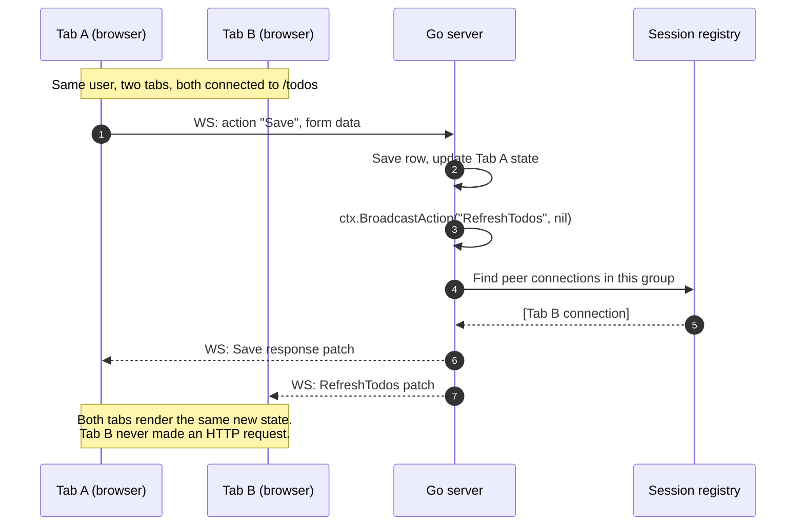

# Broadcast & Server Push

The [single-action flow recipe](/recipes/architecture-flow) covers what happens when one user clicks one button. This page covers **what happens when there are many users, many tabs, many sessions** — and how the framework keeps them coherent without you writing diffing or messaging code.

## The two propagation mechanisms

LiveTemplate exposes two ways for one user's action to update other connected viewers:

- **`ctx.BroadcastAction(...)`** — after the current action succeeds, dispatches a named action to peer connections in the same session group. The canonical use: a user has the app open in two tabs and edits a row in tab 1; tab 2 runs a `Refresh...` action and updates.
- **`session.TriggerAction(...)`** — dispatches a named action from server-owned work such as goroutines, timers, subscriptions, or background job callbacks.

Both reuse the same diff-and-patch pipeline as a single-user action; the difference is **when the action is enqueued and which connections receive it**.

## BroadcastAction — same session group, peer tabs



Code shape:

```go
func (c *TodosController) Save(state State, ctx *livetemplate.Context) (State, error) {
    c.DB.Save(ctx.UserID(), ctx.GetString("title"))
    state.Items = c.DB.List(ctx.UserID())
    ctx.BroadcastAction("RefreshTodos", nil)
    return state, nil
}

func (c *TodosController) RefreshTodos(state State, ctx *livetemplate.Context) (State, error) {
    state.Items = c.DB.List(ctx.UserID())
    return state, nil
}
```

## TriggerAction — server push

Use `ctx.Session()` when a controller starts work that will finish later:

```go
func (c *Controller) OnConnect(state State, ctx *livetemplate.Context) (State, error) {
    session := ctx.Session()
    go func() {
        result := fetchSlowData()
        _ = session.TriggerAction("DataLoaded", map[string]any{"value": result})
    }()
    return state, nil
}

func (c *Controller) DataLoaded(state State, ctx *livetemplate.Context) (State, error) {
    state.Value = ctx.GetString("value")
    return state, nil
}
```

## Watch broadcast in action

Two embeds against the same upstream counter, sharing `session="recipe-broadcast"`. The upstream calls `ctx.BroadcastAction("Increment", nil)` (and `Decrement`) inside each handler — that's what makes the two embeds stay in lockstep:

<div class="recipe-broadcast-grid" style="display: grid; grid-template-columns: 1fr 1fr; gap: 1rem;">

```embed-lvt path="/apps/counter/" upstream="http://localhost:9091" session="recipe-broadcast" height="200px"
```

```embed-lvt path="/apps/counter/" upstream="http://localhost:9091" session="recipe-broadcast" height="200px"
```

</div>

Click `+1` in either widget; the other moves at the same time. The `session=` attribute is authoring intent (it groups the embeds visually); the actual cross-region sync comes from `BroadcastAction` plus a constant-groupID authenticator on the upstream — see the [`sharedAuth` definition in main.go](/getting-started/your-first-app#step-6).

## When to pick which

| Need | Use |
|---|---|
| A user action should update peer tabs after it succeeds | `ctx.BroadcastAction("Refresh...", nil)` |
| A background goroutine/timer/job should push to live connections | `session.TriggerAction("...", data)` |
| The current connection should update from its own action | Return the new state from the action |

Nothing crosses connections implicitly. If another connection should update, the action says so.

## How this page works

Two `mermaid` sequence-diagram blocks render client-side via tinkerdown's bundled mermaid runtime. The diagrams live next to the code shapes they describe, so changing the code is a same-file edit — no out-of-tree diagram tool, no PNG that goes stale.

For runnable examples, see the [chat example](/recipes/apps/chat) and the patterns under [Real-Time](/recipes/ui-patterns/) (Multi-User Refresh, Broadcasting, Presence Tracking).
