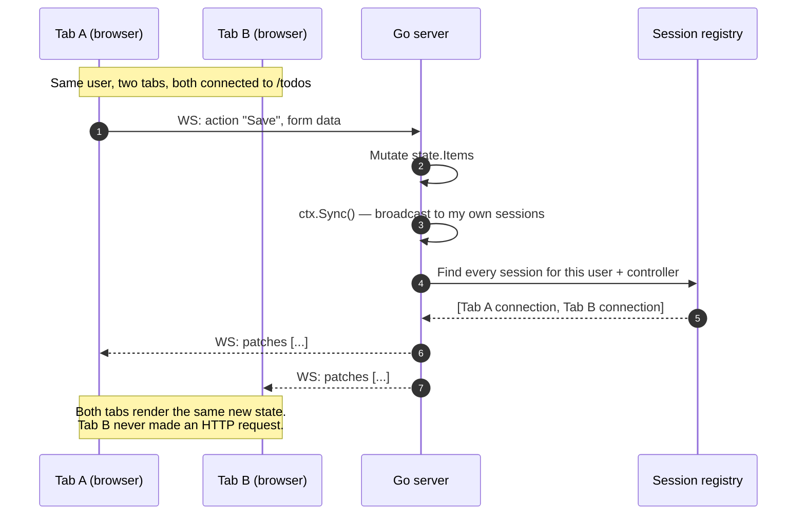
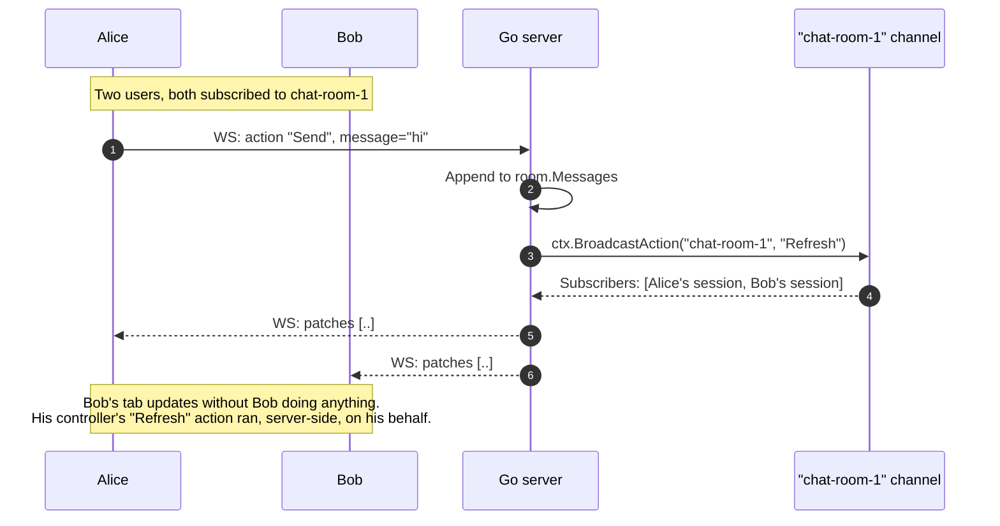

# Sync, Broadcast & Multi-User Sessions

The [single-action flow recipe](/recipes/architecture-flow) covers what happens when one user clicks one button. This page covers **what happens when there are many users, many tabs, many sessions** — and how the framework keeps them coherent without you writing diffing or messaging code.

## The two propagation mechanisms

LiveTemplate exposes two ways for one user's action to update other connected viewers:

- **`ctx.Sync()`** — re-renders the **same controller for every active session of the same user**. The canonical use: a user has the app open in two tabs and edits a row in tab 1; tab 2 updates within ~30ms.
- **`ctx.BroadcastAction(...)`** — re-renders the **same controller across DIFFERENT users** subscribed to the same broadcast channel. The canonical use: a public chat room where messages from any user appear for every viewer.

Both reuse the same diff-and-patch pipeline as a single-user action; the difference is just **whose connections receive the patch frame**.

## Sync — same user, multiple tabs



Code shape:

```go
func (c *TodosController) Save(state *State, ctx *livetemplate.Context) error {
    state.Items = append(state.Items, Item{Title: ctx.GetString("title")})
    return ctx.Sync()
}
```

## BroadcastAction — different users, shared channel



Code shape:

```go
func (c *ChatController) OnConnect(state *State, ctx *livetemplate.Context) error {
    return ctx.Subscribe("chat-room-" + state.RoomID)
}

func (c *ChatController) Send(state *State, ctx *livetemplate.Context) error {
    state.Messages = append(state.Messages, Message{Body: ctx.GetString("body")})
    return ctx.BroadcastAction("chat-room-"+state.RoomID, "Refresh")
}

func (c *ChatController) Refresh(state *State, ctx *livetemplate.Context) error {
    // Re-fetch from canonical store if needed, then return.
    // The patch pipeline runs automatically.
    return nil
}
```

## When to pick which

| Need | Use |
|---|---|
| Same logged-in user, multi-tab coherence | `ctx.Sync()` — implicit, no channel name needed |
| Different users seeing the same shared state | `ctx.BroadcastAction(channel, action)` — channel is your shard key |
| One-shot push from a background goroutine (no user action triggered it) | `controller.Push(channel, action)` from anywhere |

You almost always want `Sync()` for personal app interactions and `BroadcastAction` for collaborative / public state.

## How this page works

Two `mermaid` sequence-diagram blocks render client-side via tinkerdown's bundled mermaid runtime. The diagrams live next to the code shapes they describe, so changing the code is a same-file edit — no out-of-tree diagram tool, no PNG that goes stale.

For runnable examples, see the [chat example](/examples/chat) and the patterns under [Real-Time](/patterns/) (Multi-User Sync, Broadcasting, Presence Tracking).
