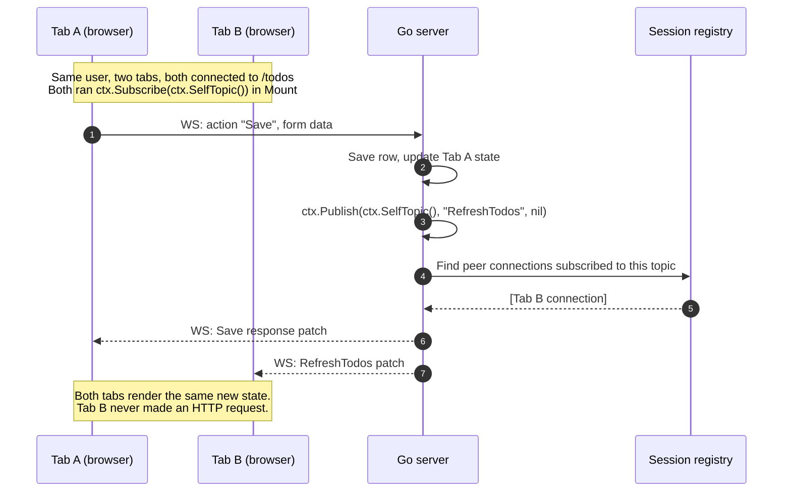

# Sync & Server Push

The [single-action flow recipe](/recipes/architecture-flow) covers what happens when one user clicks one button. This page covers **what happens when there are many users, many tabs, many sessions** — and how the framework keeps them coherent without you writing diffing or messaging code.

## The two propagation mechanisms

LiveTemplate exposes two ways for one user's action to update other connected viewers:

- **`ctx.Subscribe(topic)` + `ctx.Publish(topic, action, data)`** — peer fan-out as a two-step opt-in. Each connection that wants peer updates registers via `Subscribe` (typically in `Mount`); the action that mutated shared state fans out via `Publish`. Both calls take the same topic string — `SelfTopic()` for "my own session's tabs," a developer-defined topic like `"announcements"` for cross-session reach (admitted in `WithTopicACL`).
- **`session.TriggerAction(action, data)`** — dispatches a named action from server-owned work such as goroutines, timers, subscriptions, or background job callbacks. Independent of Subscribe/Publish: TriggerAction reaches all of a session's live connections by group ID, not by topic subscription.

Both reuse the same diff-and-patch pipeline as a single-user action; the difference is **when the action is enqueued and which connections receive it**.

## Subscribe + Publish — same topic, opted-in peers



Code shape (the canonical "broadcast to my own session"):

```go
func (c *TodosController) Mount(state State, ctx *livetemplate.Context) (State, error) {
    // Opt this connection in to peer fan-out for the session.
    _ = ctx.Subscribe(ctx.SelfTopic())
    return state, nil
}

func (c *TodosController) Save(state State, ctx *livetemplate.Context) (State, error) {
    c.DB.Save(ctx.UserID(), ctx.GetString("title"))
    state.Items = c.DB.List(ctx.UserID())
    ctx.Publish(ctx.SelfTopic(), "RefreshTodos", nil)
    return state, nil
}

func (c *TodosController) RefreshTodos(state State, ctx *livetemplate.Context) (State, error) {
    state.Items = c.DB.List(ctx.UserID())
    return state, nil
}
```

**Peer fan-out is opt-in.** A connection that didn't call `Subscribe` receives nothing — `Publish` runs cleanly but reaches zero subscribers in this group. If your peer tabs aren't updating, "did the receiver Subscribe?" is the first thing to check.

## TriggerAction — server push (independent of topics)

Use `ctx.Session()` when a controller starts work that will finish later:

```go
func (c *Controller) OnConnect(state State, ctx *livetemplate.Context) (State, error) {
    session := ctx.Session()
    go func() {
        result := fetchSlowData()
        _ = session.TriggerAction("DataLoaded", map[string]any{"value": result})
    }()
    return state, nil
}

func (c *Controller) DataLoaded(state State, ctx *livetemplate.Context) (State, error) {
    state.Value = ctx.GetString("value")
    return state, nil
}
```

`TriggerAction` routes by session group ID, not by topic subscription — the receiver does not need to have called `Subscribe`. The two mechanisms are independent: `Subscribe`/`Publish` is for "the application explicitly fans an action out to subscribed peers"; `TriggerAction` is for "the server-owned background work pushes to all of a session's connections."

## Watch peer fan-out in action

Two embeds against the same upstream counter, sharing `session="recipe-broadcast"`. The upstream's Mount calls `ctx.Subscribe(ctx.SelfTopic())` and each handler calls `ctx.Publish(ctx.SelfTopic(), "Increment", nil)` (or `"Decrement"`) — that's what makes the two embeds stay in lockstep:

<div class="recipe-broadcast-grid" style="display: grid; grid-template-columns: 1fr 1fr; gap: 1rem;">

```embed-lvt path="/apps/counter/" upstream="http://localhost:9091" session="recipe-broadcast" height="200px"
```

```embed-lvt path="/apps/counter/" upstream="http://localhost:9091" session="recipe-broadcast" height="200px"
```

</div>

Click `+1` in either widget; the other moves at the same time. The `session=` attribute is authoring intent (it groups the embeds visually); the actual cross-region sync comes from each embed calling `Subscribe(SelfTopic())` in Mount and `Publish(SelfTopic(), ...)` in the action, plus a constant-groupID authenticator on the upstream — see the [`sharedAuth` definition in main.go](/getting-started/your-first-app#step-6).

## When to pick which

| Need | Use |
|---|---|
| A user action should update peer tabs after it succeeds | Subscribe to `ctx.SelfTopic()` in Mount; `ctx.Publish(ctx.SelfTopic(), "Refresh...", nil)` from the action |
| A user action should reach beyond the current session (room, announcement) | Subscribe to a developer-defined topic (admitted in `WithTopicACL`); `Publish` to it from the action |
| A background goroutine/timer/job should push to live connections | `session.TriggerAction("...", data)` |
| The current connection should update from its own action | Return the new state from the action |

Nothing crosses connections implicitly. If another connection should update, the action says so — explicitly, by topic.

## How this page works

Two `mermaid` sequence-diagram blocks render client-side via tinkerdown's bundled mermaid runtime. The diagrams live next to the code shapes they describe, so changing the code is a same-file edit — no out-of-tree diagram tool, no PNG that goes stale.

For runnable examples, see the [chat example](/recipes/apps/chat) and the patterns under [Real-Time](/recipes/ui-patterns/) (Multi-User Refresh, Broadcasting, Presence Tracking).

